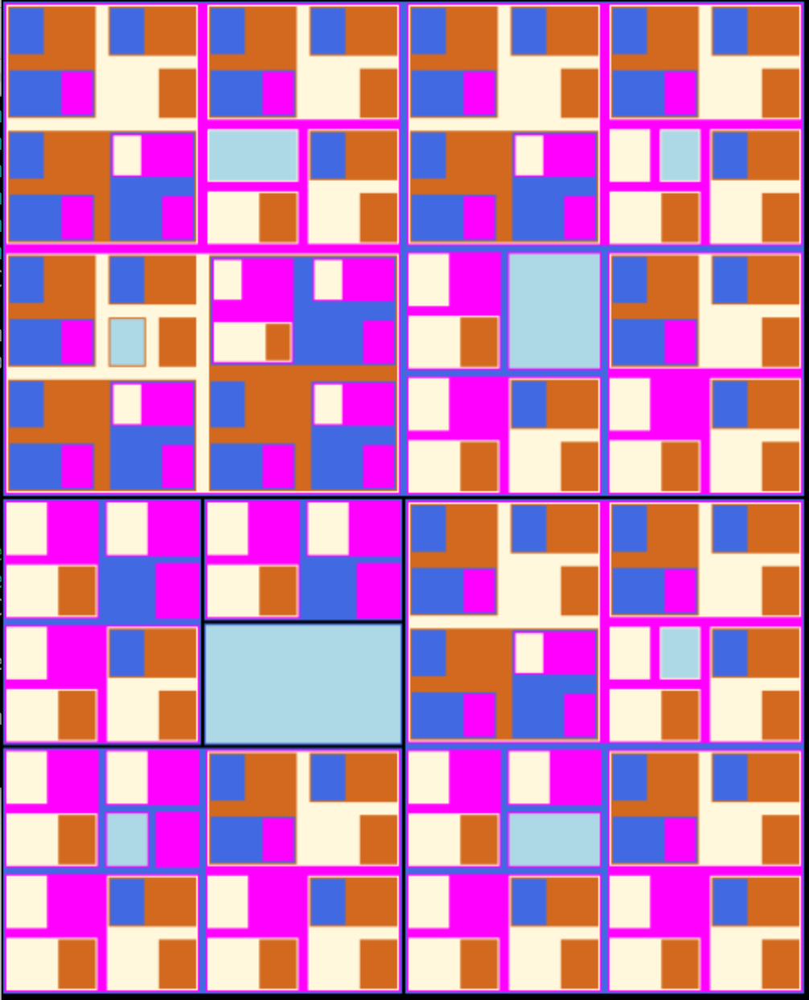

# james-siena



This guy made cool graphics before computers. I partially completed his
fractal but I didn't finish the terminal element that flips clockwise.
As I mention in the comments, it would have been better to render from a
series of points instead of initializing with a default rectangle, i.e.:

```
φ = golden ratio

// alternate the angle that gets added between diagonals
(x, y, ϑ) [0,0,0 -> x + L*cos(0), y + L/φ*sin(0 + 𝜋/2), ϑ+𝜋/2 ->
  x + L*cos(𝜋/2 + 𝜋/2), y + L*sin(𝜋/2), ϑ+𝜋/2 -> ... ]

```

and just draw the min x/y point from the diagonal implied by two
adjacent points.  This way you can skip the initial state render and the
code will have less state between each stage.

